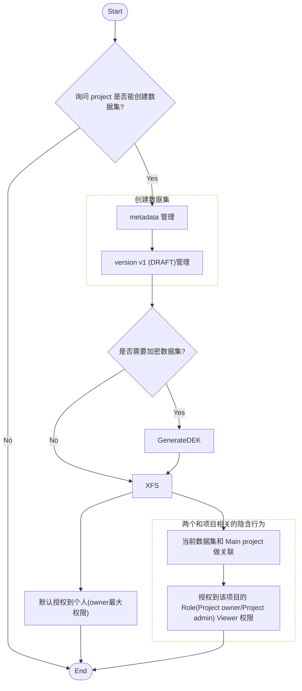
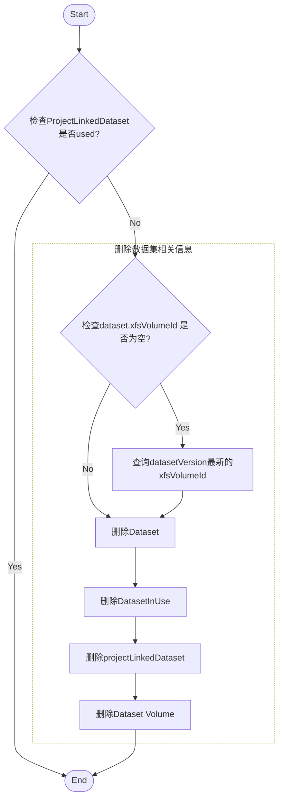
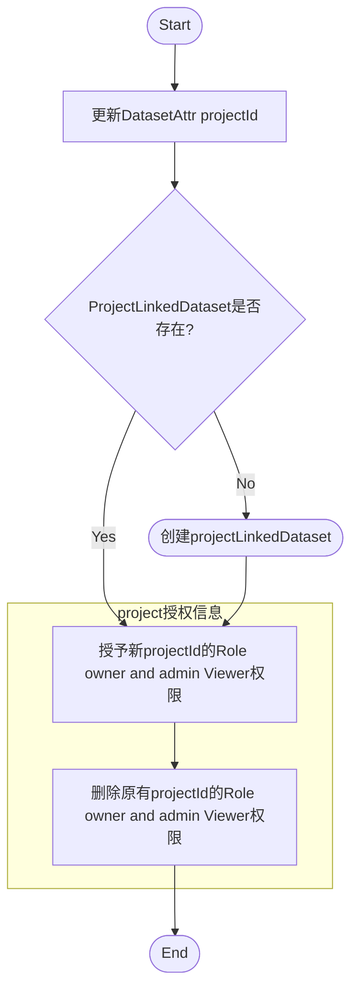

```mermaid
graph TD
    classDef wrapper fill:#fff,stroke-dasharray: 2 2;
    A([Start])
    E([End])
    subgraph dataset [创建数据集]
    B[metadata 管理] --> C["version v1 (DRAFT)管理"] 
    end

    subgraph project[两个和项目相关的隐含行为]
    attach[当前数据集和 Main project 做关联] --> authority["授权到该项目的 Role(Project owner/Project admin) Viewer 权限"]
    end

    A --> pcheck{询问 project 是否能创建数据集?}

    pcheck -->|Yes| B
    pcheck -->|No| E
   

    C --> D{是否需要加密数据集?}

    D -->|Yes| KMS[GenerateDEK]
    D -->|No| XFS
    KMS --> XFS

    XFS --> perm["默认授权到个人(owner最大权限)"]
    XFS --> attach

    perm & authority --> E
    class dataset,project wrapper

```

```mermaid
graph TD
	classDef wrapper fill:#fff,stroke-dasharray: 2 2;
	A([Start])
	E([End])
	
	subgraph dataset [删除数据集相关信息]
	bcheck{检查dataset.xfsVolumeId 是否为空?}
	bcheck -->|Yes|version[查询datasetVersion最新的xfsVolumeId]
	bcheck -->|No|B[删除Dataset]
	version --> B
	B --> C[删除DatasetInUse] --> D[删除projectLinkedDataset] --> F[删除Dataset Volume]
	end
	
	A --> pcheck{检查ProjectLinkedDataset是否used?}
	
	pcheck -->|Yes| E
	pcheck -->|No| bcheck
	F --> E
	
	class dataset wrapper


```

```mermaid
graph TD
	A([Start])
	E([End])
	
	subgraph project [project授权信息]
	toAdd[授予新projectId的Role owner and admin Viewer权限] --> toDelete[删除原有projectId的Role owner and admin Viewer权限]
	end
	
	A --> B[更新DatasetAttr projectId]
	B --> pcheck{ProjectLinkedDataset是否存在?}
	
	C([创建projectLinkedDataset])
	pcheck -->|No|C
	pcheck -->|Yes|toAdd
	
	C --> toAdd
	
	toDelete --> E
	
	
	
	
```

