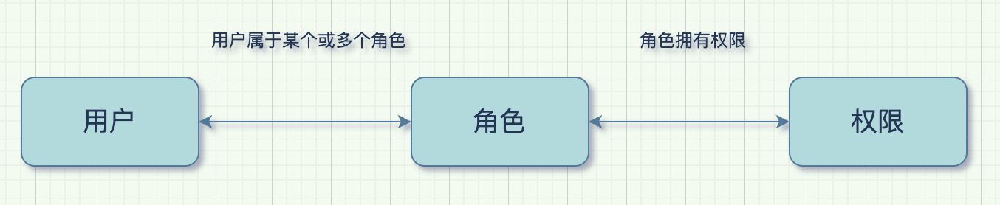

## RBAC

RBAC（Role-Based Access Control）基于角色的访问控制，通过角色关联用户，角色关联权限的方式间接赋予用户权限。

## RBAC模型的分类

RBAC模型可以分为：RBAC0、RBAC1、RBAC2、RBAC3 四种。其中RBAC0是基础，也是最简单的，相当于底层逻辑，RBAC1、RBAC2、RBAC3都是以RBAC0为基础的升级。

一般情况下，使用RBAC0模型就可以满足常规的权限管理系统设计了

### 2.1 RBAC0模型

最简单的用户、角色、权限模型，这里面又包含了2种：

1. 用户和角色是多对一关系，即：一个用户只充当一种角色，一种角色可以有多个用户担当。
2. 用户和角色是多对多关系，即：一个用户可同时充当多种角色，一种角色可以有多个用户担当。

推荐使用多对多的权限体系，保证系统的可扩展性。

### 2.2 RBAC1模型

相对于RBAC0模型，增加了子角色，引入了继承概念，即子角色可以继承父角色的所有权限，同时可以额外拥有其他权限。

### 2.3 RBAC2模型

基于RBAC0模型，增加了对角色的一些限制：角色互斥、基数约束、先决条件角色等。

- **角色互斥：**同一用户不能分配到一组互斥角色集合中的多个角色，互斥角色是指权限互相制约的两个角色。案例：财务系统中一个用户不能同时被指派给会计角色和审计员角色。
- **基数约束：**一个角色被分配的用户数量受限，它指的是有多少用户能拥有这个角色。例如：一个角色专门为公司CEO创建的，那这个角色的数量是有限的。
- **先决条件角色：**指要想获得较高的权限，要首先拥有低一级的权限。例如：先有副总经理权限，才能有总经理权限。

### 2.4 RBAC3模型

称为统一模型，它包含了RBAC1和RBAC2，利用传递性，也把RBAC0包括在内，综合了RBAC0、RBAC1和RBAC2的所有特点

## 在项目中应用

权限管理是用来控制用户可以访问而且只能访问某些资源的系统

我们系统中的权限分为什么？

* 功能权限：系统执行权限控制的基本单元，包括页面权限、菜单权限、按钮权限（增删改查）等
* 数据权限：包括基础数据、业务数据、资源数据，哪些人可以看到哪些数据，不可以看到哪些数据

**像数据集、项目两类资源，都属于我们平台中的数据权限，不用的用户看到的都不一样。**

1. 针对功能权限，我们系统中根据当前用户的角色，返回其对应功能模块的权限范围。

2. 针对数据权限，可以利用RBAC模型，通过角色来实现。例如：在`project`中，根据当前用户在该`project`中的角色（owner、editor、viewer），是否可以查看相应的项目应用列表、实例列表、项目成员列表等，以及该用户对项目下这些资源的操作权限（启动、删除、编辑）等
3. 数据集：用户申请数据集权限（读、写、执行），该数据集就授权给这个用户。该用户是这个数据集的maintainer or viewer。也可以跟project一样，把人加入到数据集相应角色中。

