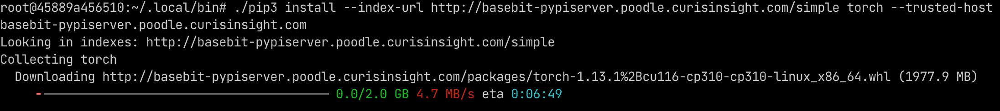

## 使用 pypiserver 搭建 PyPI Server

不推荐使用 devpi ，针对超过 1 G 的 .whl 文件就无法进行操作了

* 目前大部分的pypi服务器都采用 pypiserver
* pypiserver 社区更加活跃，GitHub star 更多


```
docker run --name devpi \
    --publish 3141:3141 \
    --volume /Users/zhijing.zhang/Public/go-best/demo-kit/data/wheelhouse:/wheelhouse \
    --volume /Users/zhijing.zhang/Public/go-best/demo-kit/data/devpi:/data \
    --env=DEVPI_PASSWORD=123456 \
    --restart always \
    muccg/devpi
    
```


# 进入容器

docker exec -it -u root devpi bash

# 登陆并上传

devpi use http://<host_ip>:3141/root/public --set-cfg
devpi login root 123
devpi upload --from-dir /wheelhouse


上传完成后可以使用 http://<host_ip>:3141 查看 pip 本地源服务器状态。
若要临时使用可以使用 pip install 的 --index 和 --trusted-host 选项

## 使用方式

临时使用 pip install 的 --index 和 --trusted-host 选项

`pip install --index http://<host_ip>:3141/root/public/+simple/ \
            --trusted-host <host_ip>`


或者永久修改 pip.conf 文件

```
# vim ~/.pip/pip.conf
[global]
index_url = http://<host_ip>:3141/root/public/+simple/
trusted-host = <host_ip>
[search]
index = http://<host_ip>:3141/root/public/
```


# 使用方式

## 一、上传

1. 手动上传到我们的持久化存储下

   1. 首先下载对应系统下的 pip 包，通过 scp 命令上传到我们的持久化目录（pvc）下，这里需要运维操作 pvc命令

   2. 进入服务，执行：

      ```shell
      devpi login root --password 123456
      devpi use http://localhost:3141/root/public --set-cfg
      devpi upload --from-dir /wheelhouse
      ```

2. 通过 k8s cp 命令进行上传

   1. cp文件到pod 的 wheelhouse 目录，例如

      ```
      kubectl cp pandas121-1.1.3-cp38-cp38-macosx_10_9_x86_64.whl xcore/devpi-service-0:/wheelhouse
      ```

   2. 进入容器执行如下命令

      ```shell
      devpi login root --password 123456
      devpi use http://localhost:3141/root/public --set-cfg
      devpi upload --from-dir /wheelhouse
      ```

   

3. 通过 twine 进行上传

   ```
   twine upload --repository https://basebit-devpi.hkha-test.basebit.me/root/public -u root -p 123456 my-package-18.6.0.tar.gz
   ```

   这里需要客户自己上传，这里上传失败了，还没找到原因


## 二、下载

1. 临时形式

   临时使用 pip install 的 --index 和 --trusted-host 选项

   `pip install --index http://<host_ip>:3141/root/public/+simple/ \
               --trusted-host <host_ip>`

   

2. 永久形式

   1. 用户自己修改 pip.conf 文件，重启需要再次修改

      ```
      # vim ~/.pip/pip.conf
      [global]
      index_url = http://enigma2-devpi-service:3141/root/public/+simple/
      trusted-host = enigma2-devpi-service
      timeout = 60
      [search]
      index = http://enigma2-devpi-service:3141/root/public/
      ```

      

   2. 提供的 Jupiter 等镜像，写死我们的 devpi 服务域名

      


## 三、部署

使用 k8s 的持久化存储方式：`StatefulSet` 形式，需要写对应的yaml文件


## devpi 无法上传超过1G的包

切换到 pypiserver 可以安装超过1G的 whl 包

下载的包都放在： `/data/packages`里

使用的时候：`pip install --index-url http://172.17.0.2:8080/simple torch --trusted-host 172.17.0.2`


### 测试

下载最新的ubuntu镜像，在里面安装 python3.10 & pip

```
# 安装 python3
apt-get install python3.10

# 安装 pip
apt-get update

apt-get install python3.10-distutils

curl https://bootstrap.pypa.io/get-pip.py -o get-pip.py

python3 get-pip.py --user


# 安装 curl
apt-get install curl

```


```shell
docker run -p 80:8080 pypiserver/pypiserver run -a . -P .

docker cp torch-1.13.1+cu116-cp310-cp310-linux_x86_64.whl unruffled_sinoussi:/data/packages

```


以下是测试我们的k8s集群里的devpi-service-0




./pip3 install --index-url http://basebit-pypiserver.poodle.curisinsight.com/simple torch --trusted-host basebit-pypiserver.poodle.curisinsight.com


事实证明 devpi 不适合部署 pypi ，另外参考了其他的一些pypi源，大概率采用的都是pypiserver，其star也是最多的，说明社区比较活跃。


参考：

https://learnku.com/articles/26872

https://blog.csdn.net/Stephen_Curry11/article/details/107566830


