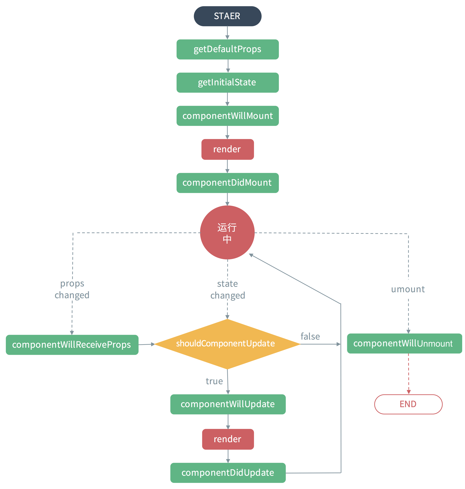
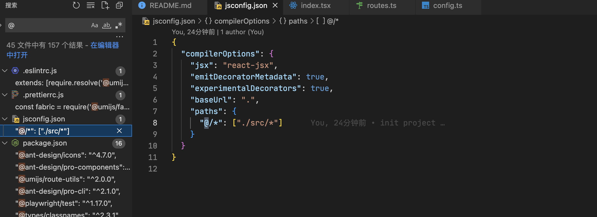

react生命周期函数

### @规则

1. 在 js 、ts 里用意，需要配置的，另外还有 `~` 表示某种意义

@ 等价于 /src 这个目录，免得你写麻烦又易错的相对路径

Webpack 里配置的，有很多地方都可以配置

2. 在css中

   `@import "路径";` 表示先导入另一个css文件。

   `@charset "utf-8";`告诉浏览器该css文件，使用的字符编码集是 utf-8，必须写到第一行；可以不写

