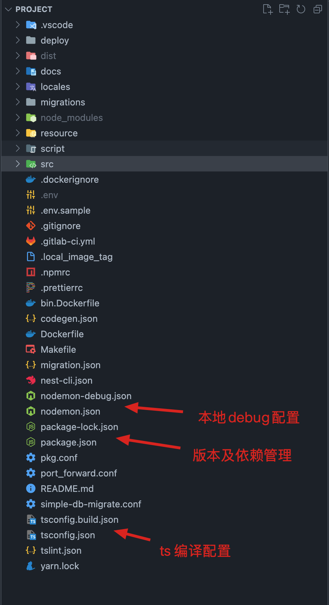

## Nest 框架介绍

> Nest (NestJS) 是一个用于构建高效、可扩展的 Node.js 服务器端应用程序的开发框架。它利用 JavaScript 的渐进增强的能力，使用并完全支持 TypeScript （仍然允许开发者使用纯 JavaScript 进行开发），并结合了 OOP （面向对象编程）、FP （函数式编程）和 FRP （函数响应式编程）

在底层，Nest 构建在强大的 HTTP 服务器框架上，例如 [Express](https://expressjs.com/) （默认），整个框架类似于 nodejs 版的 Spring


Nest 同时兼容 TypeScript 和 **纯 JavaScript** 。由于 Nest 使用编程语言的最新功能（es6语法），要将其与原始的 JavaScript 一起使用，我们需要 [Babel](https://babeljs.io/) 编译器的协助。

### 项目结构

```
// 创建一个 nestjs 项目
$ npm i -g @nestjs/cli
$ nest new project-name

```

公司内部项目结构




### Nest中重要的几个概念

控制反转（IoC）与依赖注入（DI）

* 控制反转是一种在软件工程中解耦合的思想，调用类只依赖接口，而不依赖具体的实现类，减少了耦合。控制权交给了容器，在运行的时候才由容器决定将具体的实现动态的“注入”到调用类的对象中。
* 依赖注入是一种设计模式，可以作为控制反转的一种实现方式。依赖注入就是将实例变量传入到一个对象中去
* 通过IoC框架，类A依赖类B的强耦合关系可以在运行时通过容器建立，也就是说把创建B实例的工作移交给容器，类A只管使用就可以


### 1. 基础功能

1. **Controller 控制器**：功能就是「处理传入的请求和向客户端返回响应」，被 @controller 装饰的类，在module中把它倒入到对应的controller中就能够使用它。

   ```tsx
   // op_role.controller.ts
   @ApiUseTags('op_roles')
   @Controller('op_roles')
   @UseGuards(
       new IsLoginGuard({
           jwtSecert: configService.get('JWT_DEFAULT_JWT_SECRET'),
           defaultJwtIssuer: 'OPERATION_API',
           defaultJwtAlg: 'HS256',
           redisClient: Enigma2IoRedisClient.delayGet('default'),
           redisKeyPrefix: REDIS_KEY_PREFIX,
       }),
       new XBBOpAclsGuard(),
   )
   export class OpRoleController {
   
       @Post('')
       @ApiOperation({ title: '创建运营平台角色', operationId: 'OpRoleController.createOpRole' })
       @ApiOkResponse({ description: '', type: CUSuccessDto })
       @IsLogin()
       @AddBbtOpAcls({ roles: [OpRole.admin] })
       @BBTTransaction(SERVER_NAME)
       async createOpRole(@Req() req, @Body() dto: OpRoleDto, @BBTContext() ctx: Context): Promise<CreateOpRoleResponse> {
           try {
               const res = await this.opRoleService.createOpRole(ctx, dto);
               return { id: res };
           } catch (ex) {
               throw ex;
           }
       }
   }
   
   // op_role.module.ts
   import { OpRoleService } from './op_role.service';
   import { OpRoleController } from './op_role.controller';
   import { Module } from '@nestjs/common';
   
   @Module({
       controllers: [OpRoleController], // 把 controller放在这个里面就好了 通过@Module 装饰器将元数据附加到模块类中 Nest 可以轻松反射（reflect）出哪些控制器（controller）必须被安装
       providers: [OpRoleService],
   })
   export class OpRoleModule {}
   ```

   

2. **Provider 提供者**：是 `Nest` 的一个基本概念。许多基本的 `Nest` 类可能被视为 provider - `service`,` repository`, `factory`, `helper` 等等。 他们都可以通过 `constructor` **注入**依赖关系。这意味着对象可以彼此创建各种关系，并且“连接”对象实例的功能在很大程度上可以委托给 `Nest`运行时系统。 Provider 只是一个用 `@Injectable()` 装饰器注释的类。

   Provider 它被用作 service 角色 ，

   ```tsx
   @Module({
       controllers: [OpRoleController],
       providers: [OpRoleService], // 声明 provider
   })
   ```

   * 在`op_role.service.ts`中 `@Injectable()`装饰器声明的 `OpRoleService`类是一个可以由 `Nest Ioc`容器管理的类。

   * 在 `op_role.controller.ts`中 `OpRoleController`声明了一个依赖于`OpRoleService`的构造函数注入：

     `constructor(private readonly opRoleService: OpRoleService)`

   * 在 `op_role.module.ts`中 ，将标记`OpRoleService`与`op_role.service.ts`文件中的`OpRoleService`类相关联。这种关联即是注册。

   当 `Nest IoC` 容器实例化 `OpRoleController` 时，它首先查找所有依赖项*。 当找到 `OpRoleService` 依赖项时，它将对 `OpRoleService`contractor 上执行查找，并根据上述步骤（上面的＃3）返回 `OpRoleService` 类。 假定单例范围（默认行为），`Nest` 然后将创建 `OpRoleService` 实例，将其缓存并返回，或者如果已经缓存（Ioc容器池），则返回现有实例。

   

3. **Module 模块（核心依赖注入思想）**：

   **依赖注入形式**：

   1. 构造器形式：默认采用这种形式，将 provider 注入到 controller中
   2. 基于属性的注入（setter）：在属性上使用 `@Inject()`装饰器，就可以从对象管理池中获取该对象。

   ```tsx
   // 如果你需要把这个模块 暴露到全局使用可以加 一个装饰器 @Global
   
   @Global()
   @Module({ 
       controllers:[],
       imports:[], // 可以注入 其他module 或者provider
       exports:[], // 如果你这个模块中的 provider 要在别的模块中使用 你必须要在这里声明导出这个 provider ；当然也可以把这个module导出，在其他地方import一下，这样其他模块中的provider也是可以使用的
       providers:[]  // 由 Nest 注入器实例化的提供者，并且可以至少在整个模块中共享
   })
   
   ```

   exports: 由本模块提供并应在其他模块中可用的提供者的子集

   

4. **NestFactory 创建 nest 应用的工程类**：

   ```tsx
   const app = await NestFactory.create<NestExpressApplication>(AppModule);
   
   ```

   采用 nodejs 中应用成熟的 express 框架作为 web 框架。

### 2. 高级功能

1. **Middleware 中间件**：中间件是在路由处理程序 **之前** 调用的函数。 中间件函数可以访问请求和响应对象，以及应用程序请求响应周期中的 `next()` 中间件函数。 `next()` 中间件函数通常由名为 `next` 的变量表示。

   Nest 中间件实际上等价于 [express](http://expressjs.com/en/guide/using-middleware.html) 中间件。

   * 执行任何代码。
   * 对请求和响应对象进行更改。
   * 结束请求-响应 周期。
   * 调用堆栈中的下一个中间件函数。
   * 如果当前的中间件函数没有结束请求-响应周期, 它必须调用 `next()` 将控制传递给下一个中间件函数。否则, 请求将被挂起。

   可以在函数中或在具有 `@Injectable()` 装饰器的类中实现自定义 `Nest`中间件。 这个类应该实现 `NestMiddleware` 接口

   ```typescript
   
   ```

   中间件两种定义形式，标准形式 & 函数式中间件

   ```typescript
   import { Injectable, NestMiddleware } from '@nestjs/common';
   import { Request, Response, NextFunction } from 'express';
   
   @Injectable()
   export class LoggerMiddleware implements NestMiddleware {
     use(req: Request, res: Response, next: NextFunction) {
       console.log('Request...');
       next();
     }
   }
   
   // & 函数式中间件
   export function logger(req, res, next) {
     console.log(`Request...`);
     next();
   };
   
   ```

   中间件使用：可以作用在特定的routes上 & 全局使用

   * 只适用于某几个路由

     ```typescript
     import { Module, NestModule, MiddlewareConsumer } from '@nestjs/common';
     import { LoggerMiddleware } from './common/middleware/logger.middleware';
     import { CatsModule } from './cats/cats.module';
     
     @Module({
       imports: [CatsModule],
     })
     export class AppModule implements NestModule {
       configure(consumer: MiddlewareConsumer) {
         consumer
           .apply(LoggerMiddleware)
           .forRoutes('op_roles');
       }
     }
     
     // or
     consumer
       .apply(logger)
       .forRoutes(OpRoleController);
     ```

   * 多个中间件使用

     ```typescript
     consumer.apply(cors(), helmet(), logger).forRoutes(CatsController);
     ```

   * 全局中间件

     ```typescript
     // 一次性将中间件绑定到每个注册路由，可以使用由 INestApplication 实例提供的 use() 方法
     const app = await NestFactory.create(AppModule);
     app.use(logger);
     ```

     

2. **Exception filter 异常过滤器**：捕获异常 & error，返回指定的 errorCode & errorMessage

   ```typescript
   app.useGlobalFilters(new DefaultExceptionFilter());
   
   @Catch()
   export class DefaultExceptionFilter implements ExceptionFilter {
       catch(error: Error, host: ArgumentsHost) {
           showErrorLog(error); // 打印异常 & error
           const res = host.switchToHttp().getResponse();
           return res.status(500).json({
                       errorCode: 'INTERNAL_ERROR',
                       errorMessage: error.message || ':<(',
                   }).end();
           }
   }
   ```

   如果是正常返回依据：
   ```typescript
    
   @ApiResponse({ status: 200, description: '', type: OraginzationIndexReponse })
   
   ```

   

3. **Pipe 管道**：管道是具有 `@Injectable()` 装饰器的类。管道应实现 `PipeTransform` 接口。

   管道有两个典型的应用场景:

   * **转换**：管道将输入数据转换为所需的数据输出(例如，将字符串转换为整数)
   * **验证**：对输入数据进行验证，如果验证成功继续传递; 验证失败则抛出异常

   ```typescript
   @Injectable()
   export class FiltersKeywordsPipe implements PipeTransform {
     transform(value: any, metadata: ArgumentMetadata) {
         filterAbleConvertFilter(value);
         return value;
     }
   }
   ```

   

4. **Guard 守卫**：守卫是一个使用 `@Injectable()` 装饰器的类。 守卫应该实现 `CanActivate` 接口。

   控制接口权限；**守卫在所有中间件之后执行，但在任何拦截器或管道之前执行**。

   ```typescript
   @UseGuards(
       new IsLoginGuard({
           jwtSecert: configService.get('JWT_DEFAULT_JWT_SECRET'),
           defaultJwtIssuer: 'OPERATION_API',
           defaultJwtAlg: 'HS256',
           redisClient: Enigma2IoRedisClient.delayGet('default'),
           redisKeyPrefix: REDIS_KEY_PREFIX,
       }),
       new XBBOpAclsGuard(),
   )
   
   ```

   守卫有一个单独的责任。它们根据运行时出现的某些条件（例如权限，角色，访问控制列表等）来确定给定的请求是否由路由处理程序处理。其实就是一种登录校验，进行 jwt token 校验，判断role

   

5. **Interceptor 拦截器**：拦截器是使用 `@Injectable()` 装饰器注解的类。拦截器应该实现 `NestInterceptor` 接口。

   * 在函数执行之前/之后绑定**额外的逻辑**
   * 转换从函数返回的结果
   * **转换**从函数抛出的异常
   * 扩展基本函数行为
   * 根据所选条件完全重写函数 (例如, 缓存目的)


在我们的项目中：service层负责完成业务逻辑，与数据库的交互，以及与第三方接口的交互工作


## Type-orm


* 为了使Entity可以在多个服务中共享，将Entity的实现代码放置在src的最外层，`/src/dataAccess`

* 引入entity

  ```typescript
  entities: [__dirname + '../../../../dataAccess/**/*.entity{.ts,.js}']
  ```

* nestjs引入的TypeOrm在我们的使用场景下存在缺陷，它对主键为Buffer类型的支持，不是很完善。使用了@basebit/nestjs_typeorm替换了@nestjs/typeorm, @basebit/typeorm替换了typeorm。

* 还有很多针对数据库的操作，这里不再介绍，具体可以查看 typeorm 文档。

## Reflect metadata

https://blog.csdn.net/weixin_66786078/article/details/122797398

## 装饰器

https://juejin.cn/post/6844904089633947661#heading-6


参考：

https://www.nestjs.com.cn/first-steps

https://docs.nestjs.cn/9/firststeps

https://juejin.cn/post/7062237525561049119

https://juejin.cn/post/7078847428455530526#heading-6