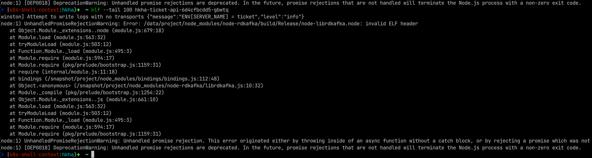

(node:1) UnhandledPromiseRejectionWarning: Error: /data/project/node_modules/node-rdkafka/build/Release/node-librdkafka.node: invalid ELF header

## 本地发布的时候，能docker build 过，但是程序一运行就抛错？

> 运行程序遇到如下报错：原因是该路径下的.so文件与运行程序的环境不匹配，比如我在mac电脑上编译生成的.so文件，直接放到linux服务器上跑了

**现象**：npm run build 能过，但是 npm start 就挂，说明生成的可执行文件在Linux不兼容。

后来试了很多次，开始以为是 build 镜像问题，也试了没问题，

然后以为是：

`RUN pkg -c pkg.conf dist/main.js --target node8-linux-x64 --public`

最后发现了一些端倪，

1. 每次 build 的时候都很慢，才发现是把 node_modules 给整进去了
2. 如果是js代码不兼容，就build！不过了，这里是bin文件不兼容，build没法帮你检查

### 原来是：.dockerignore 文件给忘记了

当我们在 docker build 的过程中，首先会将指定的上下文目录打包传递给 docker引擎，而这个上下文目录中可能并不是所有的文件我们都会在 Dockerfile 中使用到，
那么这个时候就可以在 .dockerignore 文件中指定在传递给 docker引擎 时需要忽略掉的文件或文件夹

node_modules 文件夹在构建镜像过程中如果用不到，但是又异常庞大，那么向 docker引擎 传递其实是并没有必要的（其实大家电脑性能都这么好，也不在乎这几秒钟了。
只是举个例子，可以提升镜像构建速度），这个时候就可以将 node_modules 文件夹加入 .dockerignore 文件中。 速度提升还是很明显的

